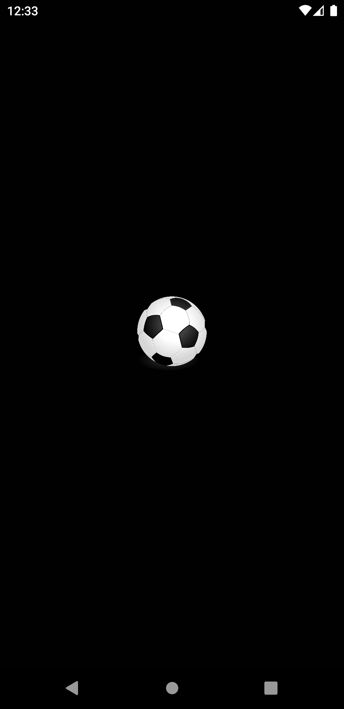
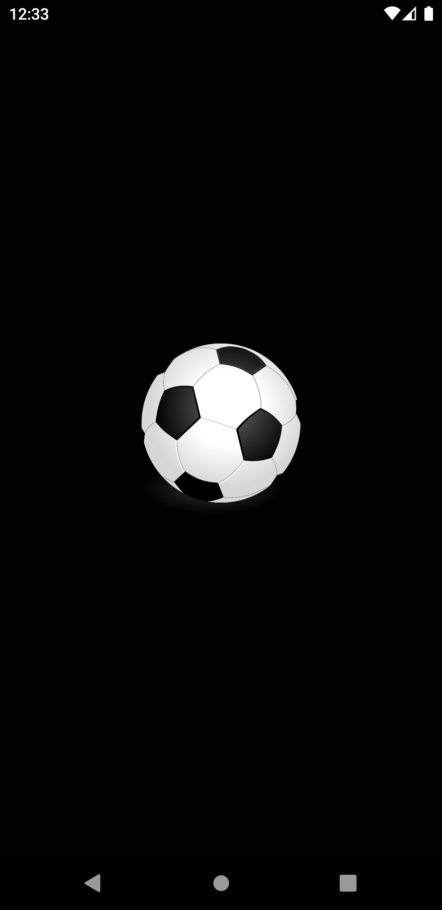
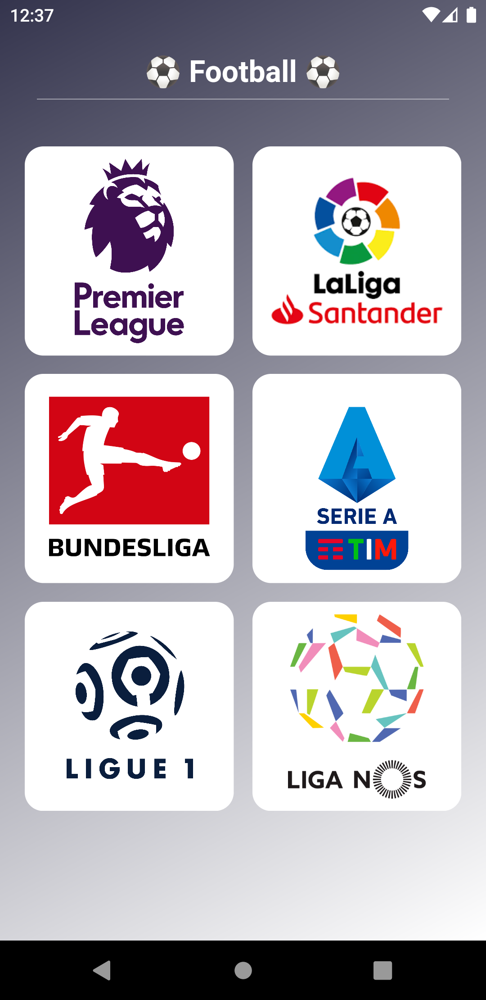
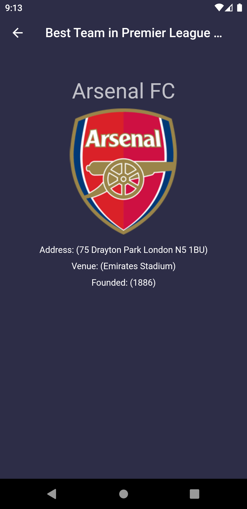

# Best Team App

A new Flutter project.

# Building the App:

This project was built with Flutter and dart For help getting started with Flutter, view
[online documentation](https://flutter.dev/docs), which offers tutorials,
samples, guidance on mobile development, and a full API reference.

https://flutter.dev/

## To run the app:

- create a .env environment with the following parameters: BASE_URL & APP_API_KEY
- I used 'https://api.football-data.org' as the BASE_URL
- update the dependencies by running `flutter pub get`
- use `flutter run` to run the project on your emulator
- use `flutter build apk` to build the app

## Screen Shots:

 
 
